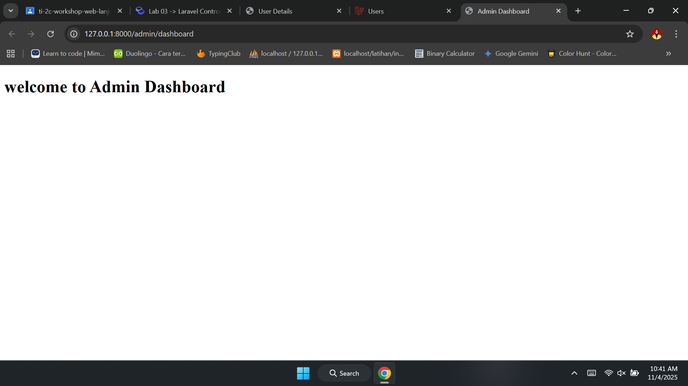
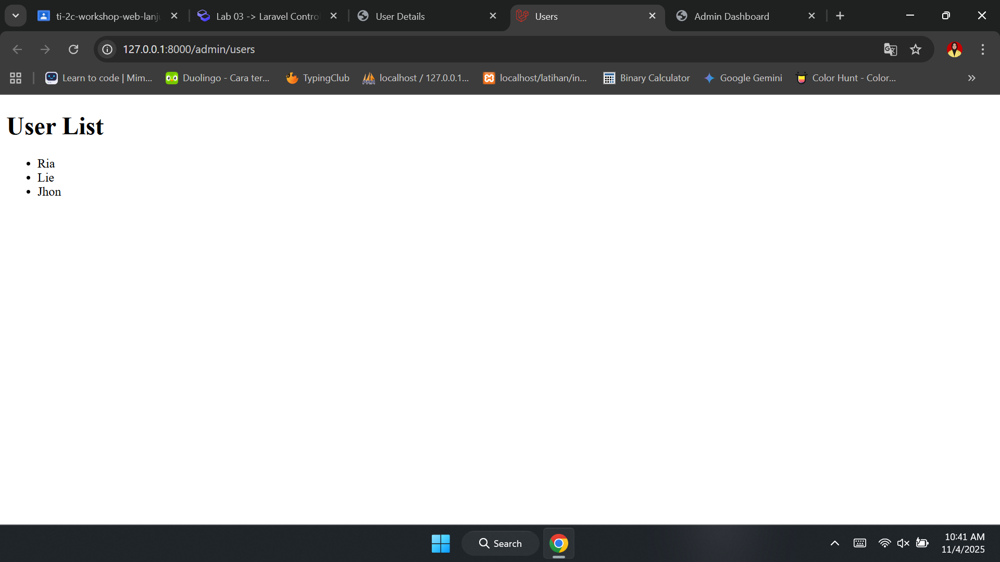
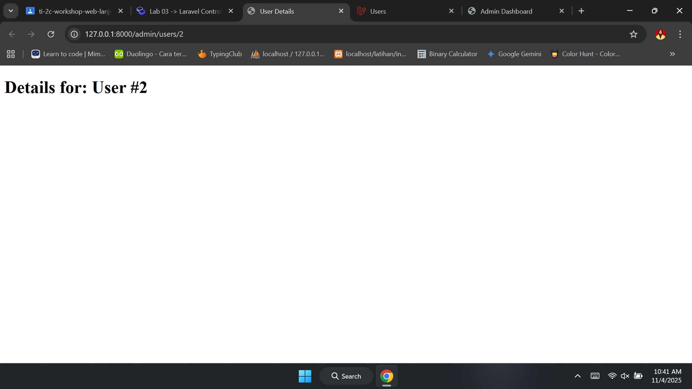

# Laporan Modul 3: Laravel Controller
**Mata Kuliah:** Workshop Web Lanjut   
**Nama:** Maila Aziza 
**NIM:** 2024573010024
**Kelas:** TI 2C

---

## Abstrak 
Laporan ini bertujuan untuk membahas tentang controller yang sangat oenting untuk menangani logika aplikasi dalam laravel. Controller berfunsi untuk menerima rute, memproses input, dan mengembalikan respons.

---
            
## 1. Dasar Teori
- Apa itu Controller
Controller Mengatur alur antara model dan view. Controller menerima input dari pengguna melalui route, memprosesnya, dan mengembalikan view atau resppons yang sesuai.

- Jenis-jenis Controller pada Laravel
laravel mendukung beberapa jenis controller:
1. Basic Controllers
2. Resource Controllers
3. Invokable Controllers
4. Pengelompokan Rute dengan Controller
5. Injeksi Permintaan dan Injeksi Ketergantungan
6. Validasi Permintaan alam Controller
7. Mengembalikan Respons dari Controller

## 2. Langkah-Langkah Praktikum
Tuliskan langkah-langkah yang sudah dilakukan, sertakan potongan kode dan screenshot hasil.

2.1 Praktikum 1 – Menangani Request dan Response View di Laravel 12

- Buat controller pada app/Http/Controllers/DemoController.php.
![Controller][tampilkan_controller]

[tampilkan_controller]: gambar\DemoController.png "gambar DemoController pada app/Http/Controllers/DemoController.php."

- Definisikan Route
![Route][tampilkan_routee]

[tampilkan_routee]: gambar\web.png "Route"

- Buat view sederhana.
1. hello.blade.php
![View][tampilkan_hello]

[tampilkan_hello]: gambar\hello.png

2. greet.blade.php
![View2][tampilkan_greet]

[tampilkan_greet]: gambar\greet.png

3. search.blade.php
![View3][tampilkan_search]

[tampilkan_search]: gambar\search.png

- Jalankan aplikasi dan tunjukkan hasil di browser.
Screenshot Hasil:
1. hello
![lab-viewhello][tampilkan_labviewhello]

[tampilkan_labviewhello]: gambar\labviewhello.png

2. greet
![lab-viewgreet][tampilkan_labviewgreet]

[tampilkan_labviewgreet]: gambar\labviewgreet.png

3. search
![lab-viewsearch][tampilkan_labviewsearch]

[tampilkan_labviewsearch]: gambar\labviewsearch.png

2.2 Praktikum 2 – Menggunakan Group Route

- Buat controller pada app/Http/Controllers/PageController.php.
![Controller2][tampilkan_controllerr]

[tampilkan_controllerr]: gambar\PageController.png "gambar DemoController pada app/Http/Controllers/PageController.php."

- Definisikan Route
![Route2][tampilkan_route2]

[tampilkan_route2]: gambar\web2.png "Route"

- Buat view sederhana.
1. home.blade.php
![View][tampilkan_home]

[tampilkan_home]: gambar\home.png

2. about.blade.php
![View2][tampilkan_about]

[tampilkan_about]: gambar\about.png

3. contact.blade.php
![View3][tampilkan_contact]

[tampilkan_contact]: gambar\contact.png

- Jalankan aplikasi dan tunjukkan hasil di browser.
Screenshot Hasil:
1. home
![lab-grouphome][tampilkan_labgrouphome]

[tampilkan_labgrouphome]: gambar\labgrouphome.png

2. about
![lab-groupabout][tampilkan_labgroupabout]

[tampilkan_labgroupabout]: gambar\labgroupabout.png

3. contact
![lab-groupcontact][tampilkan_labgroupcontact]

[tampilkan_labgroupcontact]: gambar\labgroupcontact.png

2.3 Praktikum 3 – Pengelompokan Prefix dengan Namespace Rute di Laravel 12

- Definisikan Kelompok Rute dengan Prefix dan Namespace Controller
![Route3][tampilkan_route3]

[tampilkan_route3]: gambar\web3.png "Route"

- Tambahkan Aksi ke Controller
Kita akan membuat aksi sederhana yang mengembalikan view dengan pesan selamat datang. Berikut kode untuk 

1. DashboardController.php:
![View][tampilkan_DashboardController]

[tampilkan_DashboardController]: gambar\DashboardController.png

2. UserController.php:
![View2][tampilkan_UserController]

[tampilkan_UserController]: gambar\UserController.png

- Buat view sederhana.
1. dashboard.blade.php
![View][tampilkan_dashboard]

[tampilkan_dashboard]: gambar\dashboard.png

2. users/index.blade.php
![View2][tampilkan_index]

[tampilkan_index]: gambar\index.png

3. users/show.blade.php
![View3][tampilkan_show]

[tampilkan_show]: gambar\show.png

- Jalankan aplikasi dan tunjukkan hasil di browser.
Screenshot Hasil:
1. Admin Dashboard

2. Users

3. User Details

---

## 3. Hasil dan Pembahasan
- Aplikasi berhasil dijalankan dan semua route yang didefinisikan dapat diakses melalui browser dan menampilkan tampilan yang diinginkan.

- Controller mengelola data dan meneruskannya ke View.
Data yang dikirim dari controller dapat ditampilkan pada halaman view menggunakan sintaks Blade seperti {{ $variable }}.

- Pengelompokan Route berhasil dilakukan dengan Prefix dan Namespace.
Dengan menggunakan prefix dan namespace, struktur route menjadi lebih terorganisir dan memudahkan pengelolaan banyak halaman.

- Penggunaan Blade sebagai template engine memudahkan pembuatan tampilan.
Blade memberikan fitur seperti @extends, @section, dan @include yang membuat kode lebih modular dan mudah dirawat.

---

## 4. Kesimpulan
Dalam praktikum ini mempelajari cara mendefinisikan rute, dan meneruskan data ke view. Kita juga mengeksplorasi berbagai jenis controller, seperti resource controller dan invokable controller, serta mempelajari cara mengelompokkan rute untuk organisasi yang lebih baik.
Membahas cara menangani permintaan, memvalidasi input, dan mengembalikan berbagai jenis respons.

---

## 5. Referensi
Laravel Controller — https://hackmd.io/@mohdrzu/H1sB73dnxg#Modul-3---Laravel-Controller
Bagaimana Grup Rute Laravel Dapat Menyederhanakan dan Mengatur Kode Anda — https://redberry.international/laravel-route-group-organize-your-code/

---
