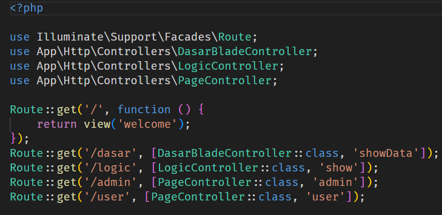
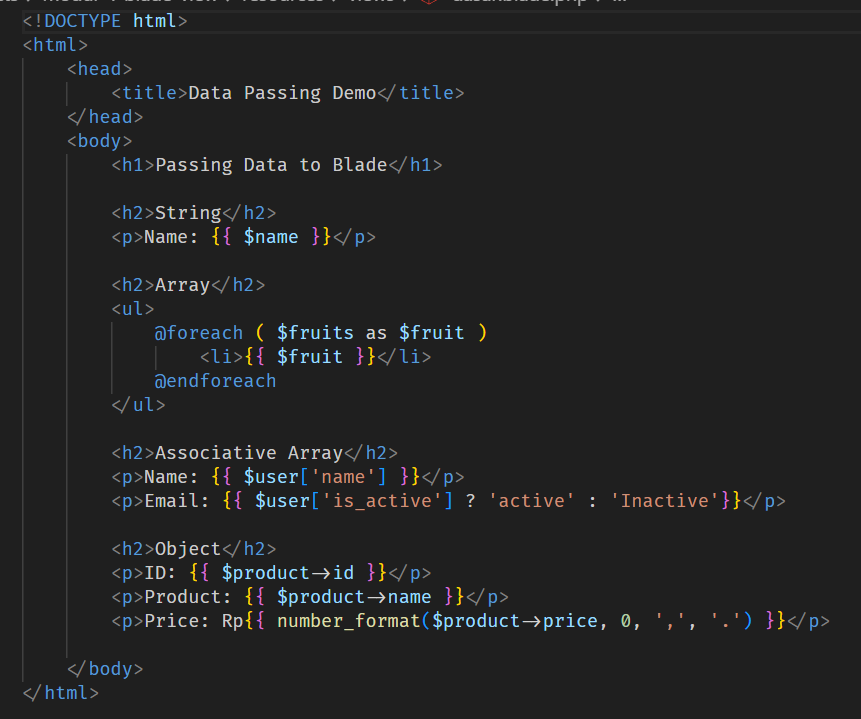
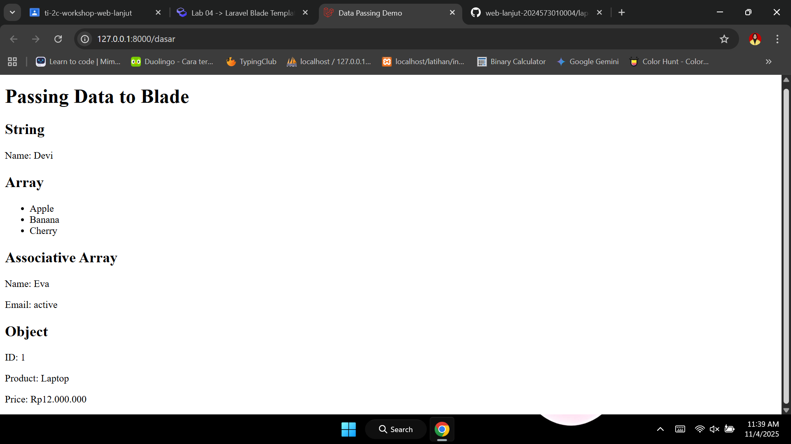
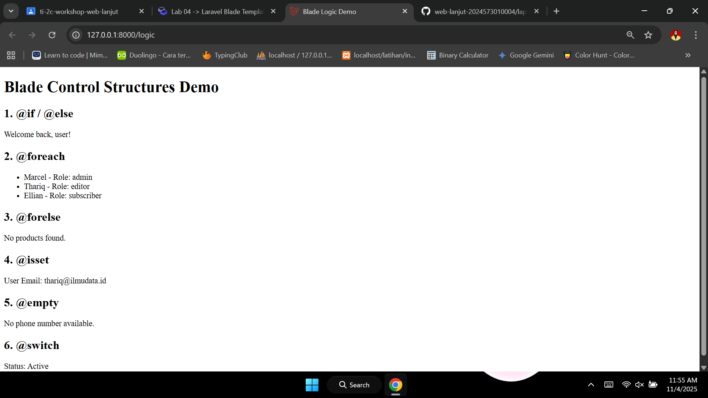
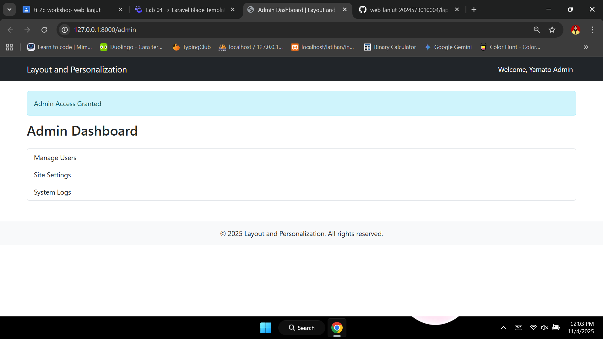
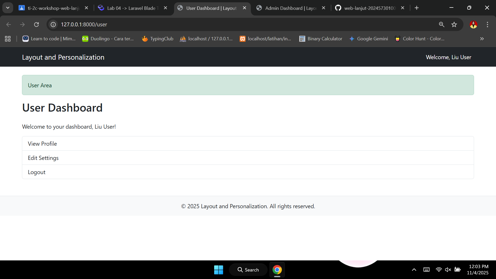
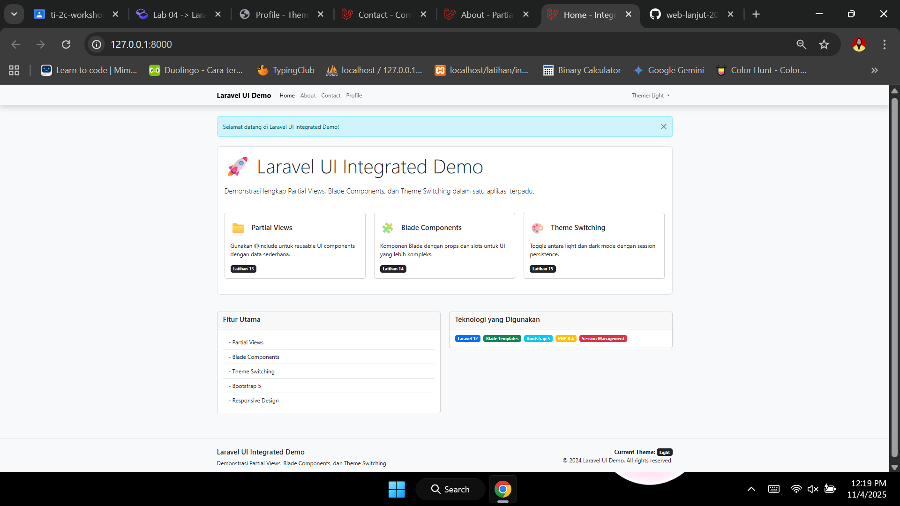
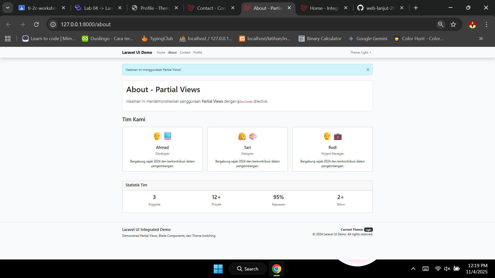
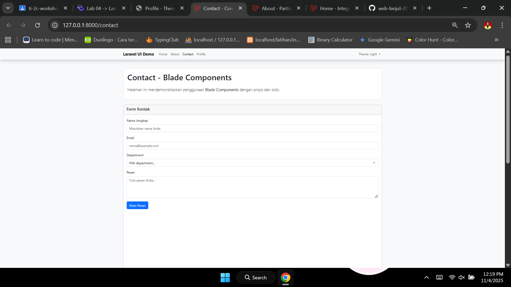
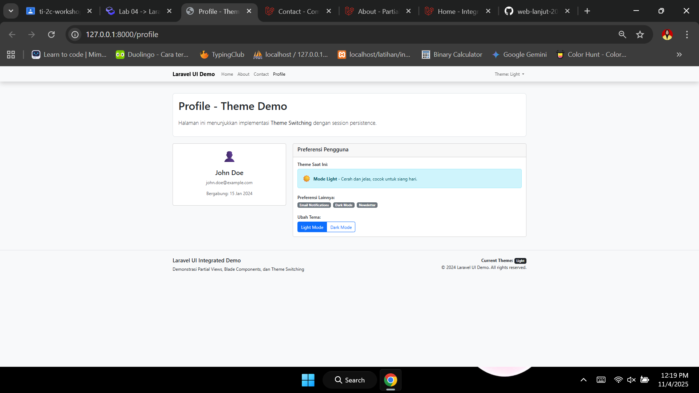

# Laporan Modul 4: Laravel Blade Template Engine
**Mata Kuliah:** Workshop Web Lanjut   
**Nama:** Maila Aziza  
**NIM:** 2024573010024
**Kelas:** TI-2C

---

## Abstrak 
Dalam praktikum ini, mengeksplorasi fitur-fitur powerful dari templating Blade di Laravel. Kita membahas berbagai aspek Blade, termasuk struktur kontrol, layout, partial views, components, dan theming. Juga untuk memahami tentang cara membuat view yang dinamis dan dapat digunakan kembali dalam aplikasi Laravel 

---

## 1. Dasar Teori

Blade adalah mesin templat bawaan Laravel yang memungkinkan pengembang menulis HTML dinamis dengan PHP tertanam dengan cara yang lebih mudah dibaca dan dipelihara. Tidak seperti templat PHP tradisional, Blade menyediakan pewarisan templat dan komponen yang dapat digunakan kembali, sehingga pengembangan menjadi jauh lebih efisien.

---

## 2. Langkah-Langkah Praktikum

2.1 Praktikum 1 – Meneruskan Data dari Controller ke Blade View

1. Buat dan buka proyek laravel bernama `modul-4-blade-view`
2. Buat sebuah Controller `php artisan make:controller DasarBladeController`
3. Definisikan Route

4. Buat Metode untuk menghandle data pada Controller

5. Buat Blade View


Hasil:



2.2 Praktikum 2 – Menggunakan Struktur Kontrol Blade

1. Buat Controller Baru `php artisan make:controller LogicController`
2. Tambahkan route baru di routes/web.php, lalu tambahkan: `use App\Http\Controllers\LogicController;
Route::get('/logic', [LogicController::class, 'show']);`
3. Tambahkan Logika `app/Http/Controllers/LogicController.php`
4. Buat file view di `resources/views/logic.blade.php`

Hasil:



2.3 Praktikum 3 – Layout dan Personalisasi di Laravel dengan Bootstrap

1. Buat Controller baru `php artisan make:controller PageController`
2. Buka routes/web.php dan tambahkan rute baru:
`use App\Http\Controllers\PageController;
Route::get('/admin', [PageController::class, 'admin']);
Route::get('/user', [PageController::class, 'user']);`
3. Update controller Di `app/Http/Controllers/PageController.php`
4. Buat Layout Dasar dengan Bootstrap. Kemudian, buat `resources/views/layouts/app.blade.php`
5. Buat direktori `admin` di `resources/views` jika belum ada. Kemudian, buat `resources/views/admin/dashboard.blade.php`
6. Buat direktori `user` di `resources/views` jika belum ada. Kemudian, buat `resources/views/user/dashboard.blade.php`

Hasil:
1. Admin:

2. User:



2.4 Praktikum 4 – Partial Views, Blade Components, dan Theme Switching

1. Buat proyek Laravel baru bernama `modul-4-laravel-ui`
2. Buat controller untuk menangani semua rute dan logika:
`php artisan make:controller UIController`
3. Buka routes/web.php dan tambahkan:
```
use App\Http\Controllers\UIController;

Route::get('/', [UIController::class, 'home'])->name('home');
Route::get('/about', [UIController::class, 'about'])->name('about');
Route::get('/contact', [UIController::class, 'contact'])->name('contact');
Route::get('/profile', [UIController::class, 'profile'])->name('profile');
Route::get('/switch-theme/{theme}', [UIController::class, 'switchTheme'])->name('switch-theme');
```
4. Update Controller `app/Http/Controllers/UIController.php`
5. Buat Layout Utama dengan Theme Support. Kemudian buat `resources/views/layouts/app.blade.php`
6. Buat direktori `partials` di `resources/views` dan buat file berikut:
`resources/views/partials/navigation.blade.php`
7. Selanjutnya, buatkan sebuah file `resources/views/partials/alert.blade.php`
8. Buat Blade Components:
```
php artisan make:component Footer
php artisan make:component FeatureCard
php artisan make:component TeamMember
php artisan make:component ContactForm
```
9. Kemudian, Edit `resources/views/components/footer.blade.php`
10. Kemudian, Edit `resources/views/components/feature-card.blade.php`
11. Selanjutnya, Edit `resources/views/components/team-member.blade.php`
12. Buat view-view utama:
`resources/views/home.blade.php`
13. Selanjutnya, buat `resources/views/about.blade.php`
14. Selanjutnya, buat `resources/views/partials/team-stats.blade.php`
15. Selanjutnya, buat `resources/views/contact.blade.php`
16. Selanjutnya, Edit `resources/views/components/contact-form.blade.php`
17. Kemudian, buat `resources/views/profile.blade.php`

Hasil:
1. Home:

2. About: 

3. Contact: 

4. Profile: 


---

## 3. Hasil dan Pembahasan
Hasil dari praktikum 4 ini adalah tahapan menggunakan Blade Template Engine dalam Laravel untuk mengelola tampilan aplikasi secara lebih terstruktur, efisien, dan mudah dikembangkan.

1. Membuat aplikasi Laravel lengkap dengan multiple pages
2. Mengimplementasikan Partial Views menggunakan @include directive
3. Membuat dan menggunakan Blade Components dengan props dan slots
4. Mengembangkan sistem Theme Switching dengan session persistence
5. Menggunakan Bootstrap 5 untuk responsive design
6. Membuat perbandingan langsung antara partial views vs components
7. Menerapkan best practices dalam struktur view Laravel
8. Aplikasi ini menunjukkan bagaimana ketiga konsep (partial views, Blade components, dan theme switching) dapat bekerja bersama dalam satu project yang kohesif dan mudah dipelihara.

---

## 4. Kesimpulan

Dari praktikum ini bisa disimpulkan bagaimana mengimplementasikan tema terang dan gelap, meningkatkan pengalaman pengguna dengan memungkinkan mereka memilih antarmuka yang mereka sukai. Bab ini menyediakan latihan praktis untuk memperkuat pemahaman tentang templating Blade dan kemampuannya.

---

## 5. Referensi

Laravel Blade Templating Engine — https://hackmd.io/@mohdrzu/r1AIUzWpll
Mesin Template Laravel Blade: Panduan Pemula — https://dev.to/icornea/laravel-blade-template-engine-a-beginners-guide-54bi

---