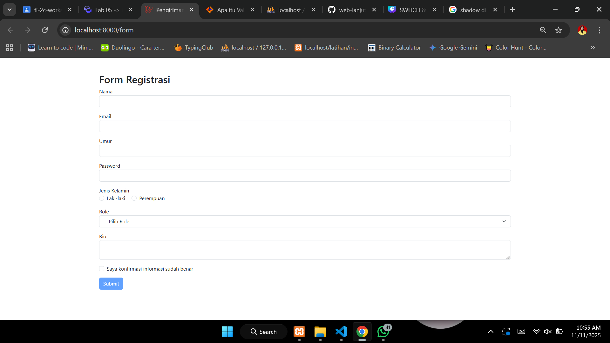
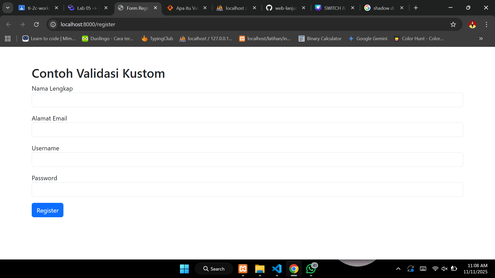
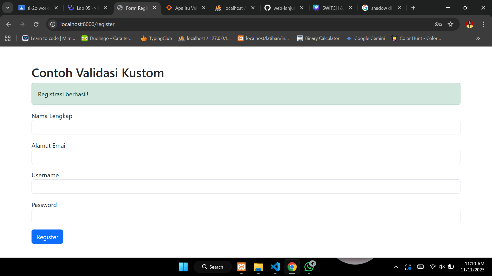
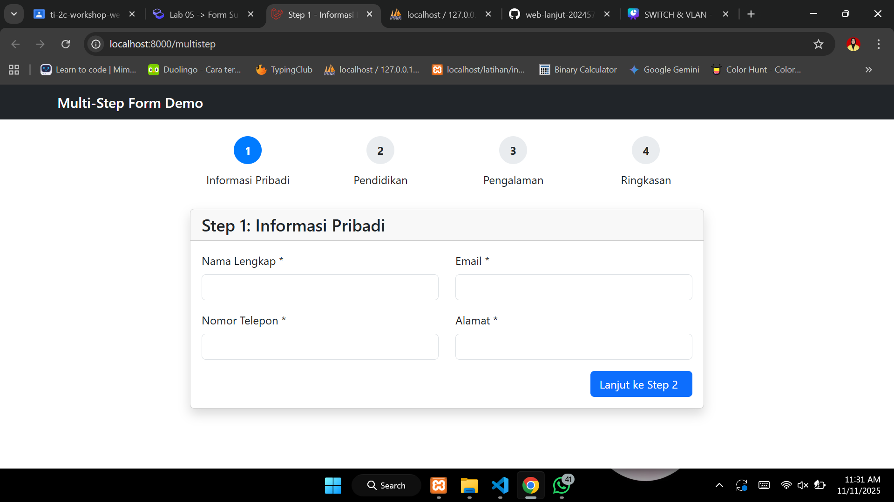

# Laporan Modul 5: Form Submission & Data Validation
**Mata Kuliah:** Workshop Web Lanjut   
**Nama:** Maila Aziza  
**NIM:** 2024573010024
**Kelas:** TI-2C

---

## Abstrak 
Dalam praktikum ini, form submission dan validasi data merupakan komponen krusial dalam pengembangan aplikasi web modern. Laravel menyediakan sistem yang robust dan elegant untuk menangani input pengguna, memvalidasi data, dan memberikan feedback yang informatif. Sistem ini dirancang dengan prinsip keamanan, kemudahan penggunaan, dan fleksibilitas.

---

## 1. Dasar Teori
Dalam konteks pengembangan web, form submission mengacu pada proses di mana pengguna mengisi formulir dan mengirimkan informasi yang dimasukkan ke server web untuk diproses. Proses ini biasanya terjadi ketika pengguna mengklik tombol kirim. Data kemudian dikumpulkan, seringkali dalam bentuk pasangan kunci-nilai, dan dikirim ke server, tempat data tersebut dapat diproses, disimpan, atau digunakan untuk menghasilkan respons. Form submission merupakan bagian fundamental dari situs web interaktif, yang memungkinkan masukan pengguna untuk tindakan seperti pendaftaran, login, pencarian, dan umpan balik.
Data validation berarti memeriksa keakuratan dan kualitas data sumber sebelum menggunakan, mengimpor, atau memproses data dengan cara lain. Berbagai jenis validasi dapat dilakukan tergantung pada batasan atau tujuan tujuan. Data Validation merupakan salah satu bentuk pembersihan data. 

---

## 2. Langkah-Langkah Praktikum

2.1 Praktikum 1 – Menangani Request dan Response View di Laravel 12

1. Buat dan buka proyek laravel bernama `form-app`
2. Buat setup routes `routes/web.php`
```
use App\Http\Controllers\FormController;

Route::get('/form', [FormController::class, 'showForm'])->name('form.show');
Route::post('/form', [FormController::class, 'handleForm'])->name('form.handle');
Route::get('/result', [FormController::class, 'showResult'])->name('form.result');

```
3. Buat Controller `php artisan make:controller FormController`
4. Buat View Form 
Buat direktori bernama form di dalam `resources/views` dan buat file bernama `form.blade.php` di dalamnya.
5. Buat View Hasil
Buat file bernama `result.blade.php` di dalam direktori `resources/views`
6. Jalankan aplikasi 
`php artisan serve`
Kunjungi http://localhost:8000/form dan test formnya.

Hasil:



2.2 Praktikum 2 – Validasi Kustom dan Pesan Error di Laravel 12

1. Mendefinisikan Route:
```
use App\Http\Controllers\RegisterController;

Route::get('/register', [RegisterController::class, 'showForm'])->name('register.show');
Route::post('/register', [RegisterController::class, 'handleForm'])->name('register.handle');
```
2. Buat sebuah controller baru
`php artisan make:controller RegisterController`
3. Buat view
Buat file bernama `register.blade.php` di dalam direktori `resources/views`
4. Jalankan aplikasi
`php artisan serve`
Buka http://localhost:8000/register untuk test form.

Hasil:




2.3 Praktikum 3 – Multi-Step Form Submission dengan Session Data

1. Buat project laravel `baru multistep-form-app`
2. Buat layout dasar `resources/views/layouts/app.blade.php`
3. Buat routes `routes/web.php`
```
<?php

use App\Http\Controllers\MultiStepFormController;
use Illuminate\Support\Facades\Route;

Route::get('/multistep', [MultiStepFormController::class, 'showStep1'])->name('multistep.step1');
Route::post('/multistep/step1', [MultiStepFormController::class, 'storeStep1'])->name('multistep.storeStep1');
Route::get('/multistep/step2', [MultiStepFormController::class, 'showStep2'])->name('multistep.step2');
Route::post('/multistep/step2', [MultiStepFormController::class, 'storeStep2'])->name('multistep.storeStep2');
Route::get('/multistep/step3', [MultiStepFormController::class, 'showStep3'])->name('multistep.step3');
Route::post('/multistep/step3', [MultiStepFormController::class, 'storeStep3'])->name('multistep.storeStep3');
Route::get('/multistep/summary', [MultiStepFormController::class, 'showSummary'])->name('multistep.summary');
Route::post('/multistep/complete', [MultiStepFormController::class, 'complete'])->name('multistep.complete');
```
4. Buat controller
`php artisan make:controller MultiStepFormController`
5. Buat Views untuk Setiap Step
6. Buat direktori `resources/views/multistep/`
- Step 1 - Informasi Pribadi: `resources/views/multistep/step1.blade.php`
- Step 2 - Informasi Pendidikan: `resources/views/multistep/step2.blade.php`
- Step 3 - Pengalaman Kerja: `resources/views/multistep/step3.blade.php`
- Step 3 - Pengalaman Kerja: `resources/views/multistep/step3.blade.php`
- Complete - Selesai: `resources/views/multistep/complete.blade.php`
7. Jalankan aplikasi
`php artisan serve`
Kunjungi http://localhost:8000/multistep.

Hasil:



## 4. Kesimpulan

Praktikum ini berhasil mendemonstrasikan pembuatan form registrasi lengkap dengan berbagai tipe input seperti text, email, number, password, radio button, select dropdown, dan textarea. Implementasi validasi server-side menggunakan Laravel's validation rules memastikan data yang dikirim memenuhi kriteria yang ditentukan sebelum diproses lebih lanjut.
Praktikum validasi kustom berhasil menunjukkan fleksibilitas Laravel dalam menangani skenario validasi kompleks dengan pesan error yang lebih informatif dan sesuai konteks, meningkatkan kejelasan komunikasi dengan pengguna. 

---

## 5. Referensi

Form Submission & Data Validation — https://hackmd.io/@mohdrzu/HJWzYp7Reg
Form Submission — https://www.periscopemedia.co/glossary/what-is-a-form-submission
Apa itu Validasi Data? — https://www.informatica.com/services-and-training/glossary-of-terms/data-validation-definition.html

---