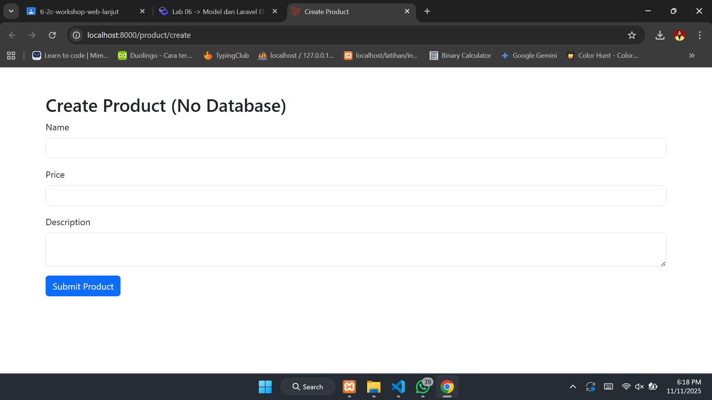
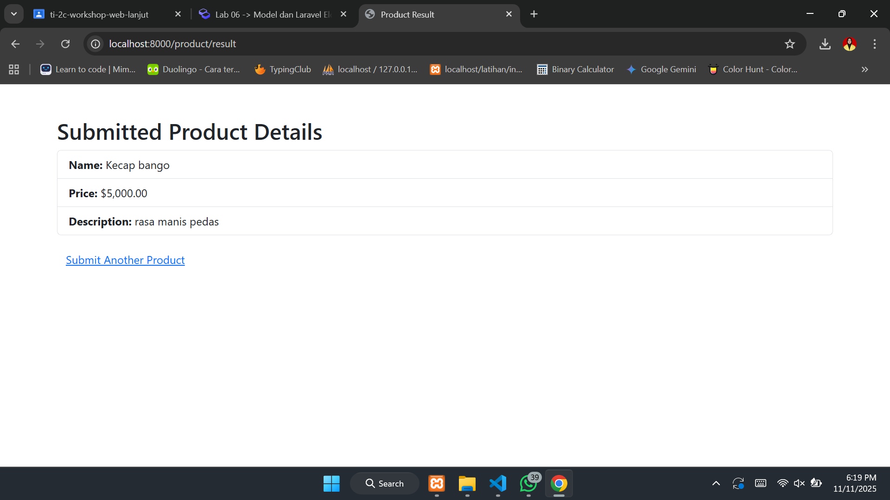
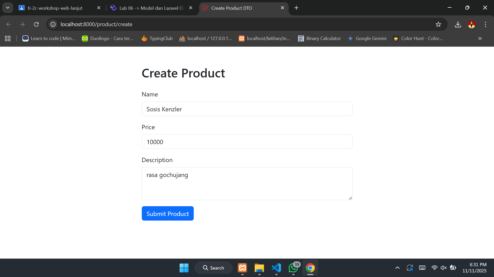
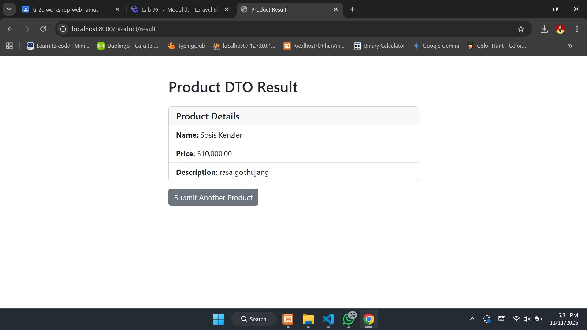
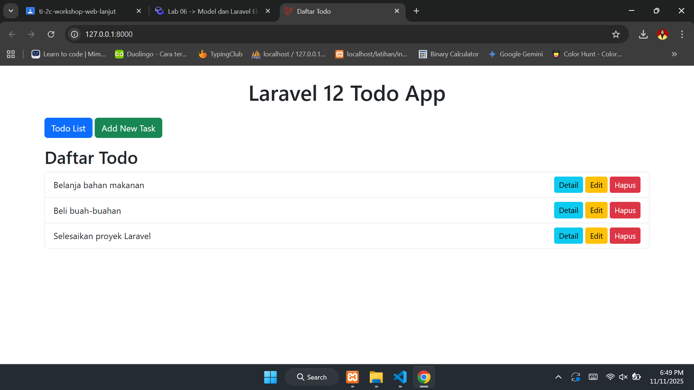

# Laporan Modul 6: Model dan Laravel Eloquent
**Mata Kuliah:** Workshop Web Lanjut   
**Nama:** Maila Aziza  
**NIM:** 2024573010024
**Kelas:** TI-2C

---

## Abstrak 
Dalam laravel, model merupakan bagian sentral dari arsitektur MVC (Model-View-Controller). Model merepresentasikan struktur data aplikasi dan digunakan untuk berinteraksi dengan database.

---

## 1. Dasar Teori
Model merupakan salah satu komponen penting dalam pengembangan web menggunakan framework Laravel. Secara sederhana, Model merupakan representasi objek dalam database yang memungkinkan kita untuk berinteraksi dengan data pada database secara mudah dan efisien.
Eloquent merupakan salah satu fitur Laravel yang dapat dimanfaatkan untuk mengakses dan memanipulasi data yang tersimpan di dalam database dengan perintah yang lebih singkat dan mempercepat proses pembuatan CRUD dari database.

---

## 2. Langkah-Langkah Praktikum

2.1 Praktikum 1 – Menggunakan Model untuk Binding Form dan Display

1. Buat dan buka project laravel
```
laravel new model-app
cd model-app
code .
```
2. Membuat model data sederhana (POCO)
`mkdir app/ViewModels`
3. Buat controller 
`php artisan make:controller ProductController`
4. Definisikan route `routes/web.php`:
```
<?php

use App\Http\Controllers\ProductController;
use Illuminate\Support\Facades\Route;

Route::get('/product/create', [ProductController::class, 'create'])->name('product.create');
Route::post('/product/result', [ProductController::class, 'result'])->name('product.result');
```
5. Buat tampilan (views) dengan bootstrap:
`mkdir resources/views/product`
kemudian buat dua file:
- `create.blade.php`
- `result.blade.php`
6. Jalankan aplikasi
`php artisan serve`
Kunjungi http://localhost:8000/product/create

Hasil:



2.2 Praktikum 2 – Menggunakan DTO (Data Transfer Object)

1. Buat dan buka project laravel
```
laravel new dto-app
cd dto-app
code .
```
2. Buat kelas DTO
`mkdir app/DTO`
3. Buat service layer
`mkdir app/Services`
4. Buat controller
`php artisan make:controller ProductController`
5. Definisikan route `routes/web.php`:
```
<?php

use App\Http\Controllers\ProductController;
use Illuminate\Support\Facades\Route;

Route::get('/product/create', [ProductController::class, 'create'])->name('product.create');
Route::post('/product/result', [ProductController::class, 'result'])->name('product.result');
```
6. Buat tampilan (views) dengan bootstrap
Buat direktori product di dalam `resources/views`:
`mkdir resources/views/product`
Buat dua file:
- `create.blade.php`
- `result.blade.php`
7. Jalankan aplikasi
`php artisan serve`
Kunjungi: http://localhost:8000/product/create

Hasil:




2.3 Praktikum 3 – Membangun Aplikasi Web Todo Sederhana dengan Laravel 12, Eloquent ORM, dan MySQL

1. Setup aplikasi dan konfigurasi MySQL
```
laravel new todo-app-mysql
cd todo-app-mysql
code .
```
- Pastikan MySQL berjalan dan buat database:
`CREATE DATABASE tododb;`
- Install dependency MySQL:
`composer require doctrine/dbal`
- Konfigurasi MySQL pada file `.env`
- Bersihkan config cache: 
`php artisan config:clear`
2. Buat migration untuk table todos:
`php artisan make:migration create_todos_table`
- Jalankan migrasi:
`php artisan migrate`
3. Buat seeder untuk data dummy
`php artisan make:seeder TodoSeeder`
- Jalankan seeder untuk mengisi database
`php artisan db:seed --class=TodoSeeder`
4. Buat model todo
- Jalankan:
`php artisan make:model Todo`
5. Buat TodoController untuk operasi CRUD
`php artisan make:controller TodoController`
6. Definisikan rute untuk aplikasi Todo di file `routes/web.php`
```
<?php

use Illuminate\Support\Facades\Route;
use App\Http\Controllers\TodoController;

Route::get('/', [TodoController::class, 'index'])->name('todos.index');
Route::get('/todos/create', [TodoController::class, 'create'])->name('todos.create');
Route::post('/todos', [TodoController::class, 'store'])->name('todos.store');
Route::get('/todos/{todo}', [TodoController::class, 'show'])->name('todos.show');
Route::get('/todos/{todo}/edit', [TodoController::class, 'edit'])->name('todos.edit');
Route::patch('/todos/{todo}', [TodoController::class, 'update'])->name('todos.update');
Route::delete('/todos/{todo}', [TodoController::class, 'destroy'])->name('todos.destroy');
```
- Beri komentar untuk menghindari konflik:
```
// Route::get('/', function () {
//     return view('welcome');
// });
```
7. Buat tampilan blade dengan bootstrap
Buat folder layouts di `resources/views` dan buat file baru `resources/views/layouts/app.blade.php`.
- Halaman todo
Sekarang kita akan membuat tampilan untuk aplikasi Todo. Buat folder baru todos di `resources/views` dan buat file-file berikut:
a. `index.blade.php`
b. `create.blade.php`
c. `edit.blade.php`
d. `show.blade.php`
8. Jalankan aplikasi
`php artisan serve`
Kemudian, kunjungi link http://127.0.0.1:8000

Hasil:



## 4. Kesimpulan
Dengan memahami model dan juga Eloquent, pengembangan aplikasi Laravel jadi lebih cepat dan kode lebih bersih karena tidak menggunakan terlalu banyak query SQL. Dan penggunaan DTO dan repository membuat kode terpisah antara logika bisnis, data access, sehingga tim pengembang bisa bekerja lebih modular.

---

## 5. Referensi

Apa itu Model pada Framework Laravel? — https://hackmd.io/@mohdrzu/ryIIM1a0ll
Laravel Eloquent (Belajar Laravel #10) — https://informatika.ciputra.ac.id/2019/11/laravel-eloquent/
Apa itu Model pada Framework Laravel? — https://buildwithangga.com/tips/apa-itu-model-pada-framework-laravel

---